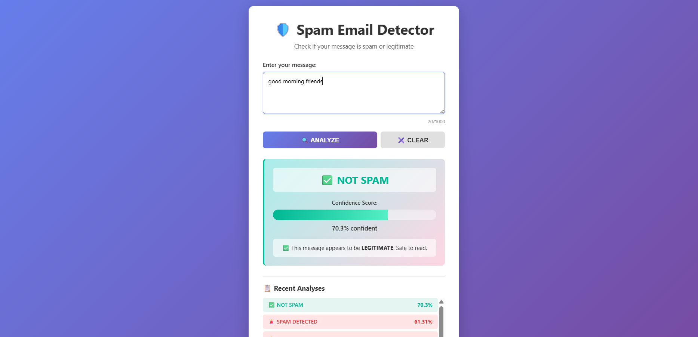
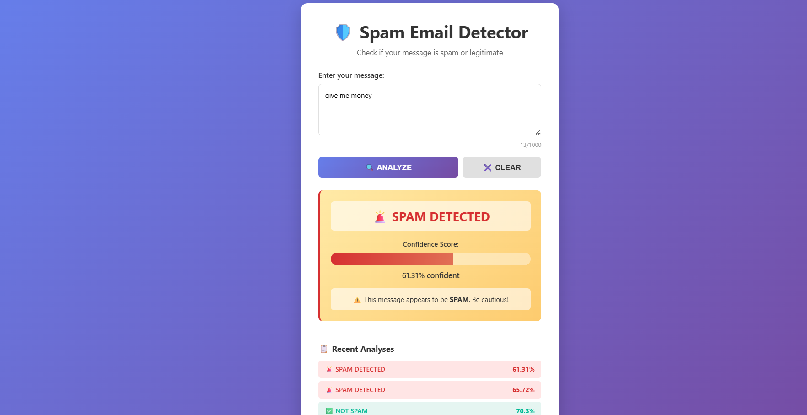
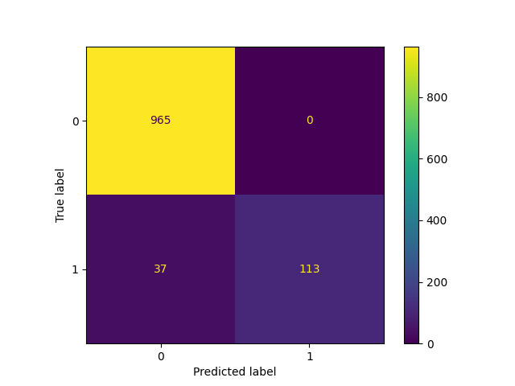
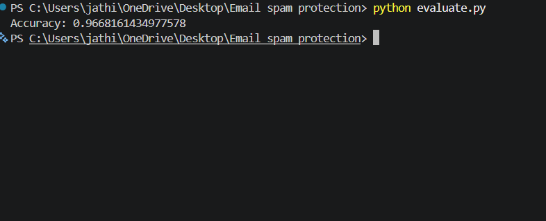

# 🚀 Spam Email Detection Web App

## 📌 Overview
This project is a full-stack ML application that detects spam messages using NLP and machine learning.

## 🛠 Tech Stack
- Python (Flask)
- Scikit-learn
- HTML, CSS

## 💡 Features
- Real-time spam detection
- Web interface for user input
- ML model using TF-IDF + Naive Bayes

## 📊 Results
- Accuracy: **96%**
- Model: Naive Bayes

## 📸 Output

### 🚨 Spam Detection


### ✅ Not Spam Detection


### 📊 Confusion Matrix


### 💻 Terminal Output


## 🚀 How to Run

```bash
pip install -r requirements.txt
python app.py
